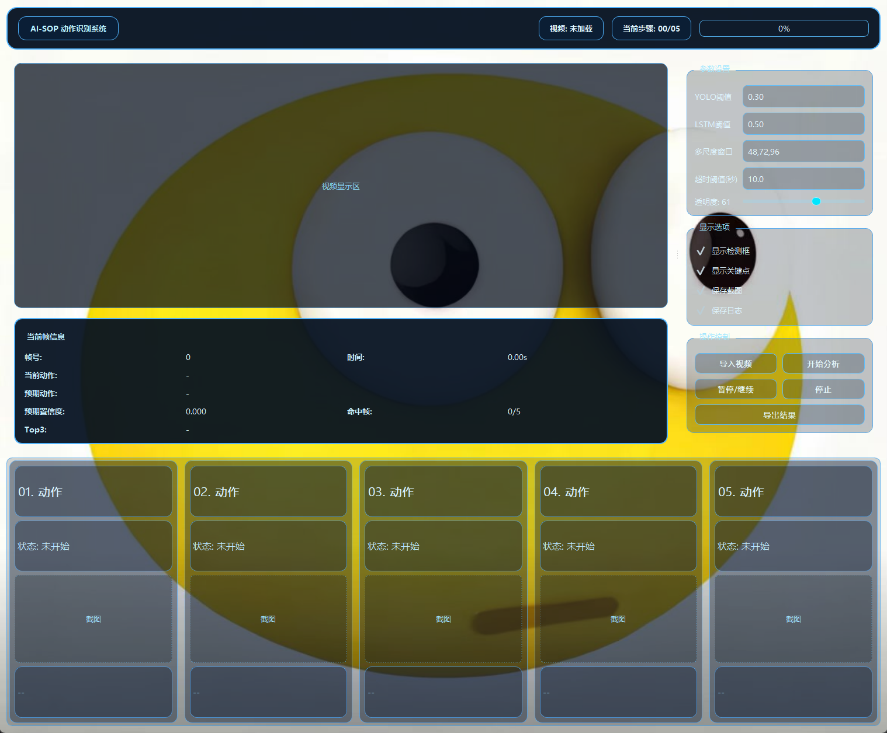
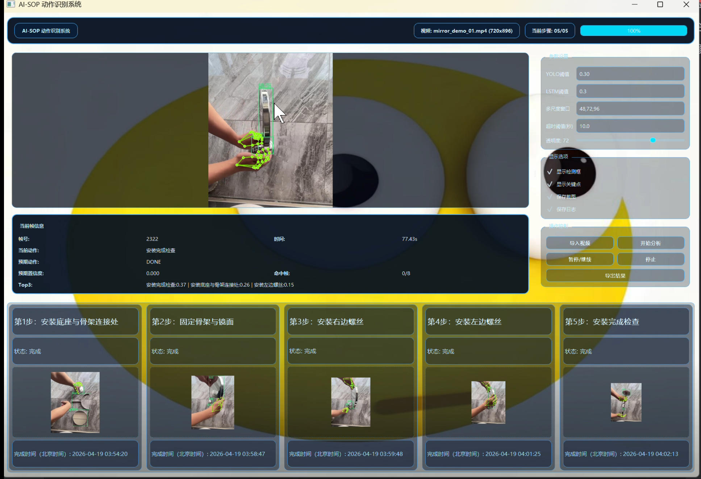
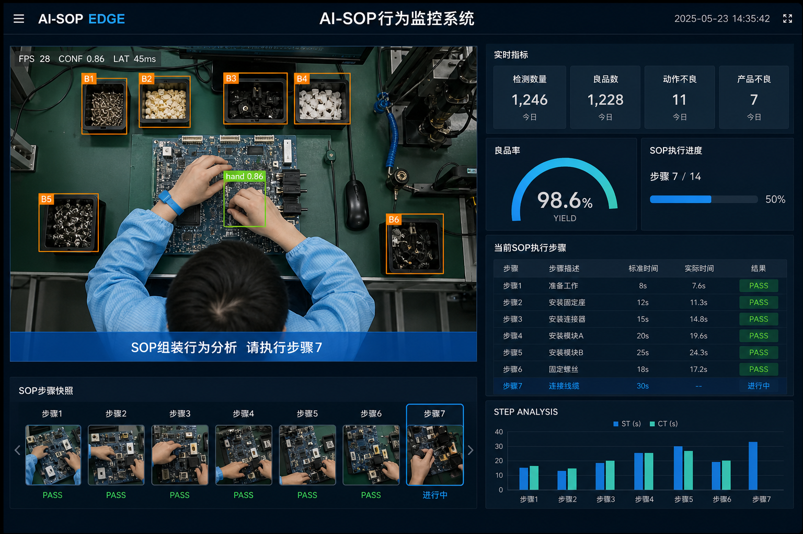
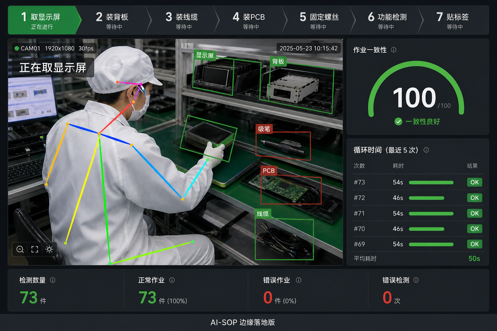
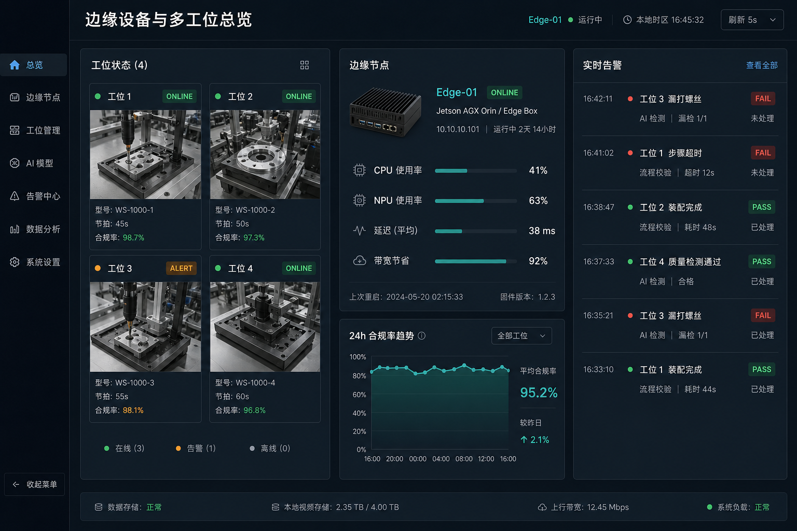
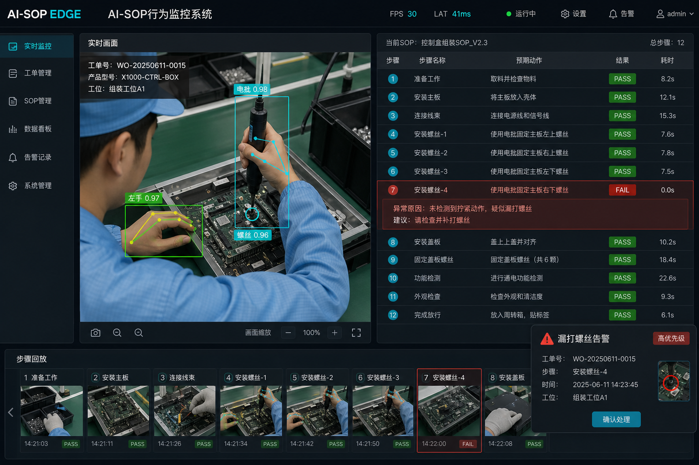
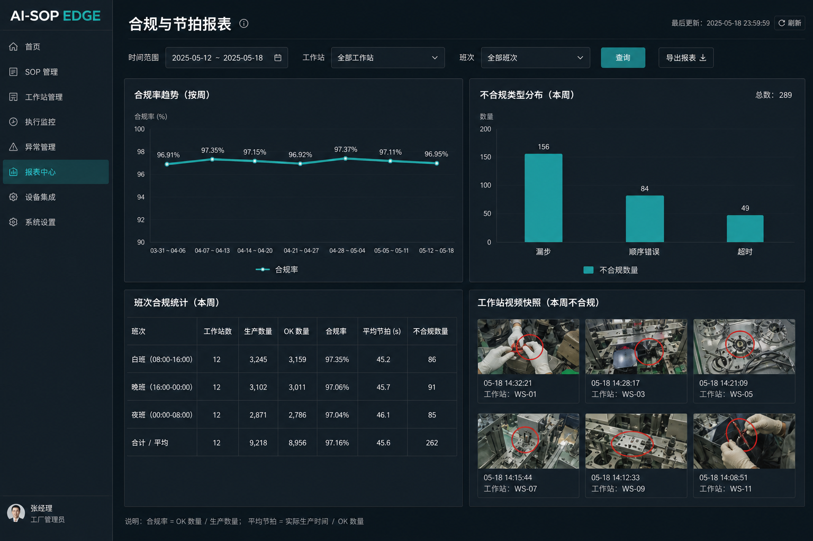
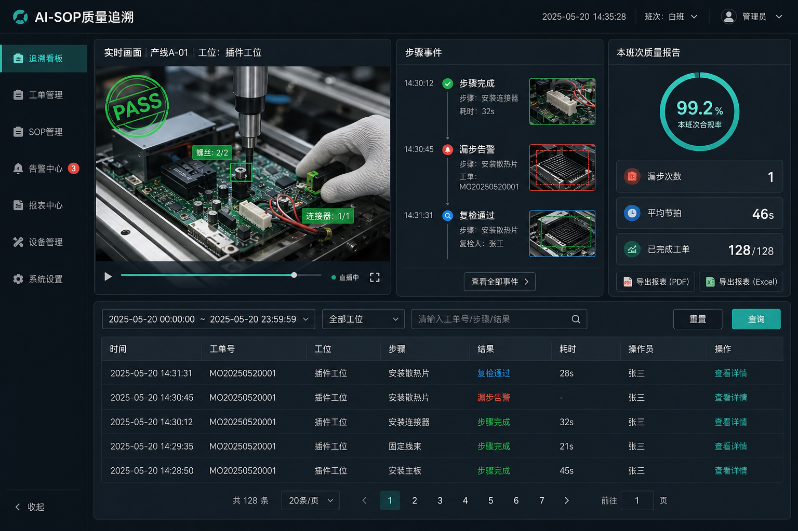
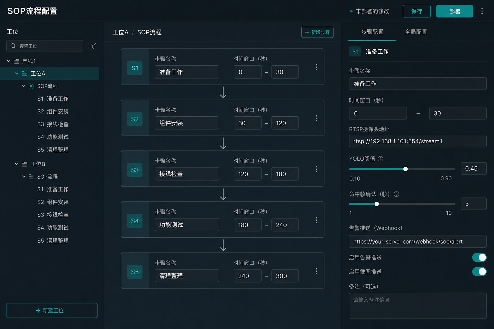

# AI-SOP 动作识别系统

> 面向装配场景的 SOP（Standard Operating Procedure）动作识别开源项目。  
> 覆盖 **数据标注 → YOLO 检测 → 特征提取 → LSTM 时序识别 → GUI 实时演示** 的完整闭环。

---

## 项目由来

大家好，我是夏别，一名热衷于音视频开发的技术爱好者。
最近在视频号、抖音等平台上，我经常看到一些关于 AI-SOP 工厂流水线质量检测 的方案展示：通过摄像头对准工位，自动判断某个螺丝是否漏打、某道工序是否遗漏，以及装配质量是否达标。
我出于好奇去咨询过相关方案，发现商业化价格并不低。
因为自己有音视频开发基础，我就想亲自弄明白：这类系统到底是怎么实现的？
然而在各大开源网站检索后，我并没有找到一个真正可用于学习、可完整复现的案例，这反而更激发了我的兴趣。
于是，我开始系统查资料、做实验、踩坑迭代，最终搭建了这一套从数据标注、模型训练到图形化演示的 AI-SOP 解决方案。
我把它开源出来，是希望尽力补上这一方向在中文开源社区中的实践空白——把技术“拆开讲清楚”，让更多开发者能看得懂、跑得通、复现得了。
也希望借助互联网的分享精神，把我所学所会尽可能公开透明地展示出来，为国内开源生态贡献一个可参考、可扩展的真实项目样例。

---

## 1. 项目定位

这个系统解决的是：

- 在装配视频中自动识别“当前正在执行的步骤”
- 判断是否按既定 SOP 顺序执行
- 在 GUI 中实时展示：当前动作、预期动作、Top3 候选、命中帧、步骤进度
- 在每个动作完成后自动截图留档，支持导出日志

适用场景：

- 毕设/课程项目展示
- 工业 SOP 质检原型验证
- 小样本动作识别系统搭建实践

视频讲解：

- [基于视觉 AI-SOP 解决方案，从训练到落地一站式讲述（B站）](https://b23.tv/F3EVu4N)

---

## 2. 系统效果图

开源演示界面：





---

## 3. 商业成品案例（边缘落地示意）

开源仓库用于学习与复现。基于同一套视觉与时序能力，可交付**边缘侧软件成品**：对接现有摄像头，本地完成步骤识别、顺序约束、漏步告警与截图留档；按工位授权，默认不提供源码。

| 能力 | 说明 |
| ---- | ---- |
| 边缘推理 | 结果在现场产出，低延迟、省带宽，视频可不出厂 |
| 软件交付 | 支持 RTSP / 存量监控接入；硬件（边缘盒）可选 |
| 可验收 | 步骤 PASS / FAIL、节拍对比、告警与留档可对指标验收 |

**界面示意**（成品能力展示，非开源 GUI）：

**实时行为监控**



**工位姿态与节拍**



**边缘多工位总览**



**漏步告警 / FAIL**



**合规与节拍报表**



**质量追溯**



**SOP 流程配置**



> 开源版请按下文自行搭建；产线落地版（授权部署 / 远程调参）欢迎私聊。VX:XiaBie6666

---

## 4. 技术栈

### 4.1 模型与算法

| 组件 | 作用 | 输入 / 输出 |
| ---- | ---- | ----------- |
| YOLOv8（Ultralytics） | 检测装配关键物体（`base` / `frame` / `mirror` / `screw`） | 输出类别、置信度、边框 |
| MediaPipe Hands | 提取手部关键点（最多 2 只手，每手 21 点） | 输出三维坐标 `(x, y, z)` |
| LSTM（PyTorch） | 识别动作步骤（S1～S5） | 输入 YOLO + 手部特征；输出类别概率、Top3、最终判定 |
| 多尺度时序窗口 | 兼顾响应速度与稳定性 | 默认窗口 `48 / 72 / 96` |

### 4.2 工程与界面

| 组件 | 用途 |
| ---- | ---- |
| PyQt5 | 桌面 GUI |
| OpenCV | 视频读取、帧处理、绘制 |
| NumPy / Pandas | 特征与标注数据处理 |
| Pillow | 中文绘制与图像处理 |

### 4.3 依赖版本

以 `requirements.txt` 为准，核心版本如下：

| 包 | 版本 |
| --- | ---- |
| ultralytics | 8.3.63 |
| torch | 2.2.2 |
| torchvision | 0.17.2 |
| mediapipe | 0.10.9 |
| opencv-python | 4.13.0.90 |
| numpy | 1.26.4 |
| pandas | 2.3.3 |
| Pillow | 10.2.0 |
| PyQt5 | 5.15.10 |

---

## 5. 总体架构

```text
视频输入
  ├─> YOLO 检测（部件目标）
  └─> MediaPipe Hands（手部时序）
        └─> 帧级融合特征
              └─> 多尺度窗口重采样
                    └─> LSTM 动作识别
                          └─> 顺序约束 + 命中帧确认
                                └─> GUI 显示 + 截图 + 日志导出
```

---

## 6. 动作定义（当前 5 步）

| 步骤 | 说明 | 标识 |
| ---- | ---- | ---- |
| S1 | 安装底座与骨架连接处 | `S1_base_frame_joint` |
| S2 | 固定骨架与镜面 | `S2_frame_mirror_fix` |
| S3 | 安装右边螺丝 | `S3_right_screw` |
| S4 | 安装左边螺丝 | `S4_left_screw` |
| S5 | 安装完成检查 | `S5_final_check` |

---

## 7. 目录结构

```text
.
├─ ai_sop_gui.py
├─ train_yolo_mirror.py
├─ requirements.txt
├─ full_timeline_10videos_template.csv
├─ 背景图片.jpg
├─ docs/
│  └─ images/                 # README 展示用图片
├─ video/
├─ yolo/
│  ├─ train/images + labels
│  ├─ val/images + labels
│  ├─ test/images + labels
│  └─ data.yaml
├─ runs_detect/               # YOLO 训练输出
└─ lstm_runs_fine/            # 时序模型权重与配置
```

---

## 8. 快速开始

### 8.1 安装依赖

```bash
pip install -r requirements.txt
```

### 8.2 启动 GUI

```bash
python ai_sop_gui.py
```

启动后可查看：

| 面板项 | 说明 |
| ------ | ---- |
| 当前动作 | 模型当前判定 |
| 预期动作 | SOP 规定的下一步 |
| 预期置信度 | 对预期步骤的置信度 |
| 命中帧 | 连续确认帧数 |
| Top3 | 候选动作排序 |
| 步骤卡片 | 未开始 / 进行中 / 完成 |

---

## 9. GUI 参数说明

| 参数 | 含义 | 调高 | 调低 |
| ---- | ---- | ---- | ---- |
| YOLO 阈值 | 检测最小置信度 | 更严格，可能漏检 | 更敏感，可能误检 |
| LSTM 阈值 | 动作确认置信阈值 | 更难通过，更稳 | 更易触发，可能误判 |
| 多尺度窗口（如 `48,72,96`） | 时序窗口长度组合 | 窗口偏长更稳、更慢 | 窗口偏短更快、易抖 |
| 透明度 | 界面显示参数 | — | 不影响算法结果 |

多尺度窗口建议使用多档融合，在响应速度与稳定性之间折中。

---

## 10. 关键机制

| 机制 | 作用 |
| ---- | ---- |
| 多尺度投票 | 同一时刻在多个窗口长度上分别预测再融合，降低偶发抖动 |
| 顺序约束 | 按预期步骤推进，避免直接跳步 |
| 命中帧确认 | 连续命中达到阈值才判定该步完成，减少瞬时误判 |

---

## 11. 支持与致谢

如果本项目对你有帮助，欢迎赞赏支持；技术问题可私聊交流。


**推动项目发展名单**

| wik | 可乐 | 于总 | 冀总 | 1234 |
| --- | ---- | ---- | ---- | ---- |
| 小飞鱼 | 码农阿凯 | 北城夜雨 | 青柠味气泡 | Pixel猫 |
| 半夏未央 | 老王敲代码 | 云边有个AI | 奶茶不加冰 | 星野Luna |
| Debug侠 | 南巷少年 | 抹茶拿铁 | 凌晨四点半 | 阿狸不熬夜 |
| 橙子汽水 | 工位观察员 | 海盐芝士 | 月光程序员 | SoftEngine |

---

## 12. 授权与免责

本项目自有代码采用 **MIT License**，欢迎学习、使用与二次开发。

**免责声明：** 因使用本项目产生的商业纠纷或侵权行为，与本项目及开发者无关，请自行承担相应风险。产线商用请自行完成合规评估与验收。
